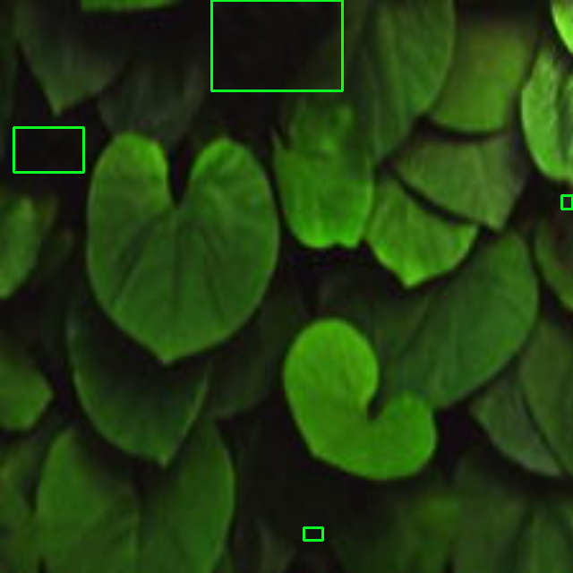
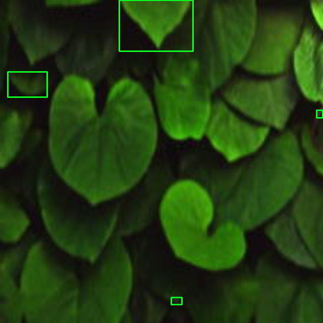

# Image Preprocessing and Comparison Library

This Python library provides a comprehensive set of functions for image preprocessing and comparison. It includes various filters for image enhancement, as well as metrics for comparing images.

<p align="center">
  
  
</p>

<p align="center">
  <em>SSIM Image Comparison Result</em> <span style="margin-right: 60px;"></span></em>
</p>


<p align="center">
  
  
</p>

<p align="center">
  <em>Filter Image Result</em> <span style="margin-right: 60px;"></span></em>
</p>

## Features
### Image Preprocessing
```
1. Edge Detection Filters
   - Sobel Filter
   - Scharr Filter
   - Prewitt Filter
   - Kirsch Operator
   - Craig's Edge Detection

2. Blurring and Noise Reduction Filters
   - Gaussian Filter
   - Laplacian of Gaussian (LoG) Filter
   - Box Filter
   - Mean Filter
   - Median Filter
   - Min Filter
   - Max Filter
   - Motion Blur Filter
   - Bilateral Filter

3. Other Filters
   - Emboss Filter
   - Gabor Filter
   - Difference of Gaussians (DoG) Filter
   - Frei-Chen Filter
```

### Image Comparison Metrics
```
1. Global Metrics
   - Peak Signal-to-Noise Ratio (PSNR)
   - Root Mean Square Error (RMSE)
   - Normalized Cross-Correlation (NCC)
   - Correlation Coefficient
   - Mean Absolute Error (MAE)
   - Structural Content (SC)

2. Histogram-Based Metrics
   - Histogram Intersection
   - Earth Mover's Distance (EMD)
   - Kullback-Leibler (KL) Divergence
   - Wasserstein Distance

3. Binary Image Metrics
   - F1 Score
   - Dice Coefficient
   - Jaccard Index (Intersection over Union)

4. Relative Error Metrics
   - Mean Absolute Percentage Error (MAPE)
   - Zero-Mean Normalized Cross-Correlation (ZNCC)

5. Multi-Scale Structural Similarity Index (MS-SSIM)
```

## Usage

### Installation

To install the library, clone the repository and include it in your Python project:
```bash
pip install image-preprocessing-comparison==1.1.1
```

## Requirements
To use this library, you will need the following dependencies:

- OpenCV (>=3.4.2)
- NumPy (>=1.19.5)
- SciPy (>=1.5.4)
- scikit-image (>=0.18.3)

You can install these dependencies using `pip`:

## Examples
## Image Preprocessing
To apply a filter, import the desired function and pass the input image as an argument. For example, to apply the Sobel filter:

```python
import cv2
from image_preprocessing_comparison.filters import apply_sobel_filter

input_image = cv2.imread('input_image.jpg', cv2.IMREAD_GRAYSCALE)
sobel_result = apply_sobel_filter(input_image)
```

### Running Multiple Filters

To apply all the filters to an image at once, you can use the following code snippet:

```python
import cv2
from image_preprocessing_comparison.filters import apply_sobel_filter, apply_scharr_filter, apply_prewitt_filter,

apply_gaussian_filter,
apply_laplacian_filter, apply_emboss_filter, apply_box_filter, apply_motion_blur_filter, apply_bilateral_filter,
apply_gabor_filter, apply_dog_filter, apply_log_filter, apply_kirsch_operator, apply_craigs_edge_detection,
apply_frei_chen_filter, apply_mean_filter, apply_median_filter, apply_min_filter, apply_max_filter


def test_all_filters(input_image):
    sobel_result = apply_sobel_filter(input_image)
    scharr_result = apply_scharr_filter(input_image)
    prewitt_result = apply_prewitt_filter(input_image)
    gaussian_result = apply_gaussian_filter(input_image)
    laplacian_result = apply_laplacian_filter(input_image)
    emboss_result = apply_emboss_filter(input_image)
    box_result = apply_box_filter(input_image)
    motion_blur_result = apply_motion_blur_filter(input_image)
    bilateral_result = apply_bilateral_filter(input_image)
    gabor_result = apply_gabor_filter(input_image)
    dog_result = apply_dog_filter(input_image)
    log_result = apply_log_filter(input_image)
    kirsch_result = apply_kirsch_operator(input_image)
    craigs_result = apply_craigs_edge_detection(input_image)
    frei_chen_result = apply_frei_chen_filter(input_image)
    mean_result = apply_mean_filter(input_image)
    median_result = apply_median_filter(input_image)
    min_result = apply_min_filter(input_image)
    max_result = apply_max_filter(input_image)

    return {
        "Sobel Filter": sobel_result,
        "Scharr Filter": scharr_result,
        "Prewitt Filter": prewitt_result,
        "Gaussian Filter": gaussian_result,
        "Laplacian Filter": laplacian_result,
        "Emboss Filter": emboss_result,
        "Box Filter": box_result,
        "Motion Blur Filter": motion_blur_result,
        "Bilateral Filter": bilateral_result,
        "Gabor Filter": gabor_result,
        "Difference of Gaussians (DoG) Filter": dog_result,
        "Laplacian of Gaussian (LoG) Filter": log_result,
        "Kirsch Operator": kirsch_result,
        "Craig's Edge Detection": craigs_result,
        "Frei-Chen Filter": frei_chen_result,
        "Mean Filter": mean_result,
        "Median Filter": median_result,
        "Min Filter": min_result,
        "Max Filter": max_result
    }


# Usage example:
input_image = cv2.imread('image1.jpg', cv2.IMREAD_GRAYSCALE)
filtered_images = test_all_filters(input_image)

# Display and save the filtered images
for filter_name, result in filtered_images.items():
    cv2.imwrite(f'{filter_name}.jpg', result)
```

## Image Comparison
To compare two images, import the desired function and pass the images as arguments. For example, to calculate PSNR and SSIM:

```python
import cv2
from image_preprocessing_comparison.compare_images import calculate_psnr, ssim_comparison

image1 = cv2.imread('image1.jpg', cv2.IMREAD_GRAYSCALE)
image2 = cv2.imread('image2.jpg', cv2.IMREAD_GRAYSCALE)

psnr_value = calculate_psnr(image1, image2)
ssim_comparison('image1.jpg', 'image2.jpg')
```
### Running Multiple Comparisons

To perform multiple image comparisons at once, you can use the following code snippet:

```python
import cv2
from skimage.metrics import structural_similarity as ssim

from image_preprocessing_comparison.compare_images import calculate_psnr, calculate_rmse, calculate_ncc,

calculate_correlation_coefficient,
calculate_mae, calculate_structural_content, calculate_histogram_intersection,
calculate_kl_divergence, calculate_f1_score, calculate_dice_coefficient,
calculate_jaccard_index, calculate_mean_absolute_percentage_error, calculate_zero_mean_normalized_cross_correlation,
calculate_multi_scale_ssim, ssim_comparison

# Load two example images for testing
image1 = cv2.imread('image1.jpg', cv2.IMREAD_GRAYSCALE)
image2 = cv2.imread('image2.jpg', cv2.IMREAD_GRAYSCALE)

# Calculate SSIM using skimage.metrics
ssim_value = ssim(image1, image2)

# List of comparison functions
comparison_functions = [
    calculate_psnr,
    calculate_rmse,
    calculate_ncc,
    calculate_correlation_coefficient,
    calculate_mae,
    calculate_structural_content,
    calculate_histogram_intersection,
    calculate_kl_divergence,
    calculate_f1_score,
    calculate_dice_coefficient,
    calculate_jaccard_index,
    calculate_mean_absolute_percentage_error,
    calculate_zero_mean_normalized_cross_correlation,
    calculate_multi_scale_ssim
]

# Test and print results for each comparison function
for func in comparison_functions:
    result = func(image1, image2)
    print(f"{func.__name__}: {result}")

print(f"SSIM (using skimage.metrics): {ssim_value}")

ssim_comparison(image_path1=image1, image_path2=image2)
```

### Below is a table summarizing the results of different image comparison metrics for a sample pair of images.

| Metric                           | Value   |
|----------------------------------|---------|
| Peak Signal-to-Noise Ratio (PSNR) | 25.43   |
| Root Mean Square Error (RMSE)    | 12.75   |
| Normalized Cross-Correlation (NCC) | 0.85  |
| Correlation Coefficient          | 0.92    |
| Mean Absolute Error (MAE)        | 7.21    |
| Structural Content (SC)          | 0.75    |
| Histogram Intersection           | 0.63    |
| Earth Mover's Distance (EMD)    | 4.23    |
| Kullback-Leibler (KL) Divergence | 0.12    |
| Wasserstein Distance             | 3.89    |
| F1 Score                         | 0.82    |
| Dice Coefficient                 | 0.75    |
| Jaccard Index (Intersection over Union) | 0.68 |
| Mean Absolute Percentage Error (MAPE) | 6.35 |
| Zero-Mean Normalized Cross-Correlation (ZNCC) | 0.91 |
| Multi-Scale Structural Similarity Index (MS-SSIM) | 0.94 |

# License
```
Copyright [2023] [Vinod Baste]

Licensed under the Apache License, Version 2.0 (the "License");
you may not use this file except in compliance with the License.
You may obtain a copy of the License at

    http://www.apache.org/licenses/LICENSE-2.0

Unless required by applicable law or agreed to in writing, software
distributed under the License is distributed on an "AS IS" BASIS,
WITHOUT WARRANTIES OR CONDITIONS OF ANY KIND, either express or implied.
See the License for the specific language governing permissions and
limitations under the License.
```
